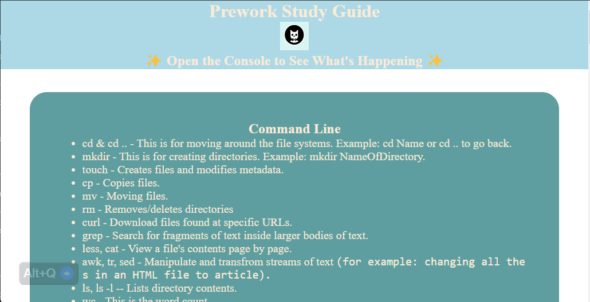
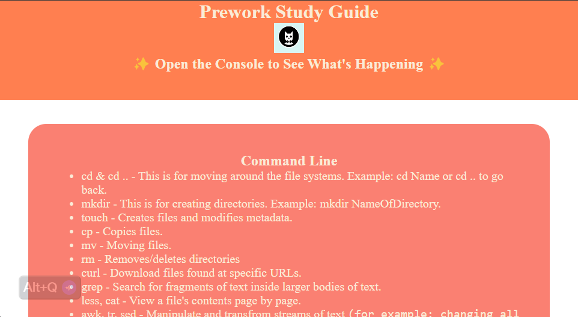
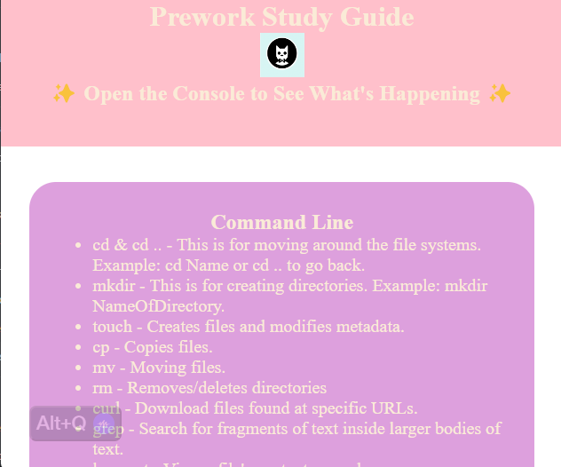

# prework-study-guide

## Description

This Prework Study Guide was created for bootcamp students who were going through the Prework before starting actual classes. It contains my notes on HTML, CSS, Advanced CSS, Git, and JavaScript.

## Installation

There is no installation required as this is a static website.

- https://kzefram.github.io/prework-study-guide/

- Pictures of the website at different sizes...
  
  
  

## Usage

To use this Prework Study Guide, you can review the notes in each section. For suggestions on what to study first, open the Chrome DevTools by pressing Command+Option+I (macOS) or Control+Shift+I (Windows). A console panel should open either below or to the side of the webpage in the browser. There you will see a list of topics we learned from the prework along with a suggestion on which topic to study first. This site has been created for educational purposes and is not intended as sole source of information.

## Credits

- Karen Bourgeois,
- UNB/EDx,
- https://developer.mozilla.org/en-US/

## License

MIT License

---

## Badges

https://github.com/users/kzefram/achievements/quickdraw

https://github.com/users/kzefram/achievements/pull-shark

https://github.com/users/kzefram/achievements/yolo

## Features

There are five section defined; HTML, CSS, Advanced CSS, Git, JavaScript.

## How to Contribute

I would appreciate any insight to making it more functional and pretty. I'm also looking to put in pages for how to do something step by step; example: cloning and creating a branch on GitHub using Git Bash and putting changes made on GitHub using Git Bash.

## Tests

- Making sure links work -
- Open your browser of choice,
- Click the link,
- Does it take you to where it says?
